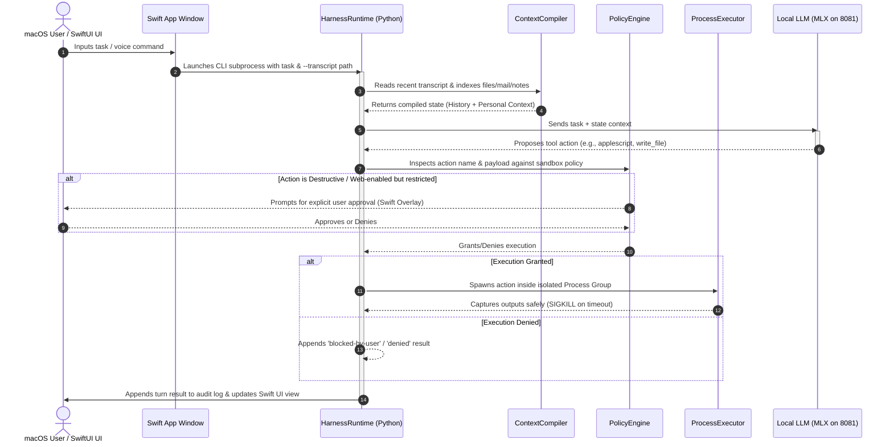

# 🍏 OpenSiri-AI: The Local Mac Personal Assistant Harness

**OpenSiri-AI** is a production-grade, highly resilient, and privacy-centric open-source harness for building a local Mac personal assistant. It is designed to bridge local open-weights foundation models (such as `eliot-9b`) to macOS system resources while enforcing a deterministic, user-permissioned safety boundary.

---

## 🏗️ Harness Architecture

OpenSiri-AI functions as a secure companion layer rather than an autonomous model runner. The harness handles context compilation, isolates tool execution, intercepts destructive calls, and maintains a stateful conversational history across independent CLI processes.



### Core Architecture Components

1.  **Harness Runtime (`HarnessRuntime`)**: Manages the multi-turn conversational loop, coordinating model queries, policy evaluations, and safe tool executions.
2.  **Context Compiler (`ContextCompiler`)**: Synthesizes the active state of the system before each turn. It compiles personal facts (via optional Hypersave integrations), reads active on-screen structures (macOS Accessibility/AX trees), and ingests past transcripts to provide **Cross-Turn Conversation Memory** (allowing Siri to resolve deictic references like *"this email"* or *"that note"* across independent run cycles).
3.  **Permission & Policy Router (`PolicyEngine`)**: A strict, deterministic gatekeeper that categorizes proposed model tool-calls (e.g., destructive, network access, local write) into safety tiers and triggers interactive or silent blocks based on active authorization profiles.
4.  **Process Executor (`Executor`)**: A highly robust, isolated subprocess runner (`process.py`). It spawns all shell, AppleScript, and Shortcuts executions inside a brand-new Process Group, issuing a `SIGKILL` to the entire process tree on timeout to avoid background orphan leaks, while shielding the runtime from crashes using unified exception boundaries and resilient Unicode decoding.

---

## 💎 Delivered Features & Capabilities

*   **Premium SwiftUI Pro UI Window**: Equipped with elegant Apple Intelligence-style rotating angular border glows (`SiriGlowBorder`), interactive 60fps waveform animations (`SiriWaveformView`), and desktop translucent glassmorphism.
*   **On-Screen Accessibility (AX) Awareness**: Siri can "see" what is on your screen (e.g., active Mail or Safari windows) and reason over it contextually.
*   **Rich Native Preview Cards**: Beautiful, frosted-glass previews that parse and display complex resource structures inline in the chat timeline, complete with NSWorkspace launching:
    *   `MailCard` with direct email deep-linking.
    *   `FileCard` with dynamic customized file type icons and open triggers.
    *   `CalendarCard` styled in a vibrant purple gradient calendar container.
    *   `ReminderCard` featuring interactive animated checkboxes and location-geofence badges.
*   **Stateful Memory Resolution**: Solves reference ambiguity across consecutive executions, remembering the topic discussed in the previous turn.
*   **Local High-Speed MLX Execution**: Built to talk directly to local foundation models (e.g., `eliot-9b-v12-mlx-4bit` on port `8081`) via MLX on Apple Silicon.
*   **Default Browser Integrity**: Prioritizes default browser commands (`open "URL"`) over blank-state Safari scripts to preserve active logins, cookies, and user accounts (e.g., autoplaying YouTube playlists seamlessly).

---

## 🚀 Upcoming Roadmap (WWDC 2026 Siri AI Alignment)

To stay perfectly aligned with Apple's latest **Siri AI (WWDC 2026)** paradigm, the following features are actively under design and positioned for future releases:

1.  **👁️ Visual Intelligence OCR & Camera Feed**:
    *   Ability to process live video/camera feeds to parse real-world entities.
    *   On-device OCR parsing for physical documents, nutrition facts, and receipts.
2.  **🌌 Spatial Window Coordinate Sync (Vision Pro)**:
    *   Expanding the Swift UI layer to support visionOS 3D windows.
    *   Translating coordinate matrices to support floating, draggable spatial widgets that anchor to real-world objects.
3.  **☁️ Deep Private Cloud Compute (PCC) Sync**:
    *   Secure, verifiable off-device execution pipelines for high-reasoning tasks that exceed local Apple Silicon compute capabilities.
4.  **⚡ Native App Intent Layer Integration**:
    *   Plugging directly into macOS's private App Intents system database, moving away from accessibility scripting to achieve instant, zero-delay action execution across all installed apps.

---

## 🚀 Quickstart & Setup

### Requirements
*   macOS 14.0+ (Sonoma) or macOS 15.0+ (Sequoia)
*   Python 3.10+
*   Xcode 15.0+ (for building the SwiftUI Wrapper app)

### 1. Harness Installation

```bash
# Clone the repository
git clone https://github.com/Nuro-Labs/opensiri-ai.git
cd opensiri-ai/eliot-harness

# Set up and activate local environment
python3 -m venv .venv
source .venv/bin/activate

# Install dependencies and local package in editable mode
pip install -e .
```

### 2. Launch Local MLX Model Server
Host your local weights on port `8081` (optimized for Apple Silicon):
```bash
python3 -m mlx_lm.server \
  --model models/eliot-9b-v12-mlx-4bit \
  --port 8081 \
  --host 127.0.0.1
```

### 3. Run Acceptance Suites
Verify that your local setup compiles and executes correctly:
```bash
# Run the WWDC Acceptance Suite (Expects 100% Pass)
python3 tests/wwdc_acceptance.py --model-url http://localhost:8081

# Run the Siri Examples Acceptance Suite
python3 tests/siri_examples_acceptance.py --model-url http://localhost:8081
```

### 4. Build and Launch the SwiftUI Desktop Application
```bash
cd app/opensiri-ai
swift build -c release
./scripts/package.sh
# Double-click the compiled app package in dist/opensiri-ai.app to launch!
```

---

## 🔒 Safety & Sandbox Contract

Any third-party connector or extension built on top of OpenSiri-AI **must** comply with the safety contract:
1.  **Fail-Closed Design**: Any destructive or external action must default to a blocked/refused state unless explicitly cleared by the active security policy.
2.  **No Direct Overwrites**: Document, database, or system modifications require explicit, interactive user approval.
3.  **Secret Redaction**: Credentials, API tokens, and session identifiers must be completely redacted before writing to the public audit log (`/tmp/opensiri_siri_examples_audit.jsonl`).
4.  **Opt-In Permissions**: External network connections and local filesystem writing are disabled by default.

---

## 🏷️ Public Positioning

*   **Do Use:** *"OpenSiri-AI, an open-source Mac personal assistant harness."*
*   **Do Not Use:** Any wording claiming official Apple Siri parity, complete autonomous operations without safety guards, or native Apple private source code integrations.
