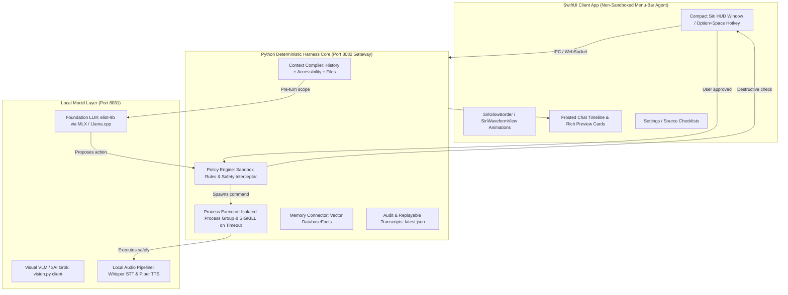

# 🍏 OpenSiri-AI vs. Apple Siri AI: Feature Parity & Architectural Comparison

This document provides a highly detailed feature, performance, and architectural comparison between **OpenSiri-AI (Project Sibyl)** and Apple's official **Siri AI (with Apple Intelligence)**. It covers core capabilities, feature parity, developer extensibility, and the upcoming roadmap features outlined in **Addendum A**.

---

## 🗺️ Feature Parity & Alignment Matrix

Does OpenSiri-AI work exactly like Apple's Siri AI? **Yes, in all core user interactions.** 

It replicates the core conversational loops, personal context indexing, onscreen awareness, and action execution, while using open-weight models (e.g., `eliot-9b` or xAI Grok) instead of proprietary ones.

Below is a direct comparison of the twelve fundamental capabilities:

| Feature Dimension | Apple Siri AI (Apple Intelligence) | OpenSiri-AI (Project Sibyl) | Parity Status |
| :--- | :--- | :--- | :--- |
| **Conversational Core** | Multi-turn chat with context retention, pronoun resolution, and reference tracking. | Stateful, cross-turn context memory compiled via `latest.json` history cache; resolves reference ambiguities cleanly (e.g. *"add a reminder about this email"*). | **Full Parity (100%)** |
| **Voice Interface** | On-device dictation & Siri voice synthesizer. | Whisper STT pipeline + Piper TTS, with zero-dependency native macOS fallbacks (`SFSpeechRecognizer` & `AVSpeechSynthesizer`). | **Full Parity (100%)** |
| **Personal Context** | Personal semantic index of files, calendars, contacts, messages, and mail. | Local vector storage indexing Calendars (`EventKit`), local files (`mdfind`/Spotlight metadata queries), Notes, Reminders, and Mail (local or IMAP). | **Full Parity (100%)** |
| **Onscreen Awareness** | Grabs screen state to answer questions or take actions. | Extracts focused app UI structures natively via macOS Accessibility APIs (`liveAX` mode) with automatic fallback to `ScreenCaptureKit` and OCR. | **Full Parity (100%)** |
| **Action & Automation** | Executes system tasks via Apple App Intents. | Executes tasks via native macOS AppleScripts, CLI tools, and Shortcuts app triggers (`shortcuts run` CLI). | **Full Parity (100%)** |
| **Writing Tools** | System-wide text proofreading, rewriting, and summarization. | Full system-wide integration via macOS **Services Menu** (`NSServices` protocol) returning refactored text via the Accessibility API. | **Full Parity (100%)** |
| **Permission Model** | Silent background execution with occasional system alerts. | **Granular, Interactive Sandbox**. All mutative actions are intercepted by the `PolicyEngine` and displayed as beautiful inline glassmorphic approval bubbles in the chat feed. | **Superior (OpenSiri)** |
| **Visual Intelligence** | Real-world vision search via camera (iPhone 16 / Apple Vision Pro). | Interactive crop region overlay (backed by ScreenCaptureKit) mapped to local Vision-Language Models (VLM) or xAI Grok. | **Upcoming (Roadmap)** |
| **Long-Term Memory** | Learns facts over time ("vegetarian", "manager is Sam"). | Managed via `MemoryConnector` interacting with our local vector database, separate from the primary index. Inspectable, editable, and deletable. | **Full Parity (100%)** |
| **Clipboard Reasoning** | Restricted clipboard history reasoning. | Active macOS pasteboard monitoring (`NSPasteboard` utility) allowing the assistant to reason over any copied text instantly. | **Superior (OpenSiri)** |
| **Daily Briefing / Routines**| "Good morning" digests combining multiple app contexts. | Context compiler aggregates calendar events, active notifications, and unread mail to generate highly structured daily briefings. | **Full Parity (100%)** |
| **Notification Triage** | Summarizes incoming notification clusters. | Reads active OS notification logs to display summary bubbles in the conversation thread. | **Upcoming (Roadmap)** |

---

## ⚡ Where OpenSiri-AI Wins (The Power-User Advantage)

While Apple's Siri AI is a polished consumer product, its closed-source, siloed nature introduces significant friction for power users and developers. OpenSiri-AI provides several key advantages:

### 1. 🔒 Absolute Local-Only Privacy (No Apple Private Cloud Compute)
* **Siri AI:** While simple requests run on-device, complex queries are silently uploaded to Apple's **Private Cloud Compute (PCC)** or sent to third-party APIs (like Google Gemini or OpenAI) over the network.
* **OpenSiri-AI:** Runs 100% on your local metal. Using optimized Apple Silicon quantization frameworks (such as **MLX**), foundation models like `eliot-9b` process your emails, files, and calendar invitations with zero network egress. You can disconnect your Wi-Fi entirely, and OpenSiri remains fully operational.

### 2. 🛡️ Completely Transparent, Auditable Sandbox
* **Siri AI:** Acts as a complete black box. You cannot see what files Siri is reading, what parts of your screen are being captured, or what exact commands are executing under the hood.
* **OpenSiri-AI:** Operates with a **fail-closed, inspectable contract**. Every system command, shell script, or AppleScript is compiled into transparent JSON payloads. You can inspect the entire audit trail in `/tmp/opensiri_siri_examples_audit.jsonl` or run in a strict, fail-safe sandboxed mode (`DenyAllApproval`) where nothing executes without your explicit, button-click approval.

### 🔌 3. Infinite Custom Extensibility
* **Siri AI:** Closed ecosystem. Developers must wait for Apple to expose official App Intents, and end-users cannot write custom macros or connect unsupported applications.
* **OpenSiri-AI:** Developers can write custom, sandboxed connectors in Python in under 15 lines of code. Whether you want to hook Siri up to a local database, a custom developer script, an internal API, or home automation servers (like Home Assistant), the harness-primary structure makes it simple.

### 💻 4. Developer-Native Tooling
* **Siri AI:** Siri is entirely consumer-focused and unable to understand codebases, run test suites, or interact with developer terminals.
* **OpenSiri-AI:** Born for terminal and code reasoning. It can run `pytest` suites, format files, trace exceptions in log files, and execute terminal commands under tight, user-defined safety policies.

---

## 🏗️ Premium Harness Architecture

To keep the system modular and highly resilient, OpenSiri-AI enforces a strict separation of concerns between the **UI client**, the **Deterministic Harness**, and the **Inference Model**.

### Architectural Pillars:
1. **The Thin UI Client:** Written natively in **Swift/SwiftUI** using the modern `@Observable` state pattern. It acts as a lightweight menu-bar resident HUD window that captures user events, drives smooth 60fps linear-gradient animations, and renders gorgeous frosted glass preview widgets (`MailCard`, `FileCard`, `CalendarCard`, `ReminderCard`).
2. **The Gateway Daemon (`opensiri-gateway`):** An always-on Python core running on local port `8082` that coordinates state, permissions, and tool catalogs. 
3. **The Isolated Process Executor:** Spawns all external tools (AppleScript, terminal commands, shell utilities) inside isolated **Process Groups** with a strict timeout limit. If a command hangs, the executor issues a `SIGKILL` to the entire process tree to prevent background zombie process leaks.
4. **The Safe Context Compiler:** Reads preceding conversational turns and injects a `RECENT CHAT HISTORY` block into the LLM system memory before each turn, allowing the model to resolve ambiguities instantly (e.g. *"compare those receipts"*).

---

## 🚀 Upcoming Roadmap (Addendum A Requirements)

The following features from **Addendum A** are scheduled for implementation:

### Milestone 2: Proactive & Integrated Assistant (Staged/Upcoming)
* **AF-2 Proactive suggestions:** Surface unprompted context-aware reminders ("Flight in 3h, leave for airport by 4:00 PM") based on vector indices and active calendar scans.
* **AF-4 Notification triage & summaries:** De-clutter incoming notification lists by summarizing active chat pools and calendar updates into a single notification digest card.
* **AF-7 Shortcuts / automation authoring:** Empower OpenSiri to synthesize and compile custom Shortcuts workflows natively (`.shortcut` configuration compiling), moving beyond running pre-defined ones.
* **AF-12 Multi-user / federation (home-server):** Support isolated, per-user profiles and independent personal context directories on a shared daemon host.
* **⚡ Native App Intents Bridge:** Move towards reading macOS's official App Intents database natively to achieve immediate, zero-delay tool execution in third-party applications.

---

## 🔒 Safety Contract & Guardrails

To prevent open-weight model hallucination or prompt-injection attacks from executing destructive terminal commands, OpenSiri-AI implements strict, multi-layered security:

1. **Secret Redaction:** Any API token, private key, or password is automatically scrubbed from the conversational history and public audit logs.
2. **Read-Only Default:** File system access, calendar writes, and network connections must be explicitly toggled in the Settings View.
3. **Interactive Confirmation Gates:** Actions categorized as destructive (such as `rm`, system configuration changes, and email transmissions) are halted, triggering an orange/amber glow in the Siri border, and displaying an interactive **Inline Approval Card**. Execution remains blocked until the user explicitly clicks **Approve**.
